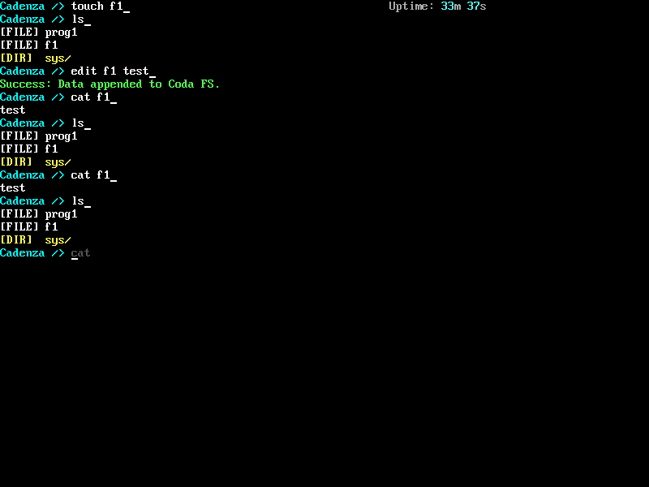

# 🎹 CadenzaOS

> *An operating system that learns how you work — and uses that knowledge to protect you.*



CadenzaOS is a 64-bit operating system built from scratch in [Zig 0.16.0](https://ziglang.org/),
running on bare-metal x86-64 hardware. It is not a Unix clone or a teaching exercise in the
traditional sense: CadenzaOS is an exploration of what an OS looks like when **behavioural
intelligence is a first-class kernel concern** rather than a bolt-on application layer.

The kernel observes, models, and acts on user and program behaviour in real time — flagging
anomalies, adapting security policy, and learning what "normal" looks like for your specific
deployment. The goal is an OS where the kernel itself is the first line of defence, not a
passive substrate waiting to be told what to do.

---

## ✨ What makes CadenzaOS different

Most operating systems treat security as something you add on top: antivirus software, firewalls,
sandboxes. CadenzaOS treats it as something built in from the ground up:

- **The Conductor** — a kernel-level state machine that monitors command velocity, I/O latency,
  and system rhythm, shifting between `Optimal`, `Discordant`, and `Critical` states in real time.
- **The Composer** — a Markov chain engine that learns your command sequences and uses that model
  to detect anomalous behaviour. If a sequence of commands looks statistically unusual for this
  user on this system, the kernel notices — before any damage is done.
- **Policy-aware superblock** — the filesystem itself carries a policy mode (`ADMIN`, `DEV`,
  `GAMING`) that governs how aggressively the Conductor responds to anomalies. Hardware-level
  policy, not application-level configuration.
- **Behavioural syscall tracking** — the kernel's syscall gateway is the natural point to extend
  this model from user commands to program behaviour: which syscalls does a program normally make,
  in what sequence, with what frequency?

This positions CadenzaOS as a research platform and proof of concept for **adaptive security at
the kernel level** — particularly relevant for constrained-use deployments (kiosk systems,
industrial terminals, secure workstations) where the set of normal operations is well-defined and
deviations are meaningful signals.

---

## 🚀 Current capabilities

CadenzaOS boots on real x86-64 hardware (legacy BIOS) and in QEMU. The following all work today:

### Boot & hardware
- Custom two-stage bootloader (`boot.asm` → `stage2.asm`) with E820 memory detection
- Long mode transition with identity-mapped + higher-half page tables
- ATA PIO disk driver (read/write, LBA28)
- PS/2 keyboard driver with scan code translation
- VGA text mode driver (80×25) and VESA framebuffer driver (800×600×24bpp)
- Serial port output (COM1, 38400 baud) mirrored alongside VGA/framebuffer
- Physical frame allocator (`bitmap.zig`) with explicit reserved ranges for all kernel structures

### Filesystem — CodaFS
- Custom extent-based filesystem with persistent superblock, space manager, and directory tree
- Survives reboots — write-through to ATA via RAM disk backing
- Full directory support: nested directories, extent-based file growth
- Commands: `ls`, `cd`, `mkdir`, `touch`, `edit`, `cat`, `stat`, `del`, `mv`, `rename`, `df`

### Shell & terminal
- Predictive ghost-text completion via Markov chain (`composer.dat` persisted in `sys/`)
- Command history navigation
- Velocity entropy monitoring — high-speed command input triggers policy-based responses
- Anomaly detection — statistically unusual command sequences prompt confirmation
- Real-time uptime display (MM:SS) and disk usage reporting

### Multitasking & binaries
- Preemptive multitasking via IRQ0 timer with full `InterruptContext` save/restore
- Dynamic task spawning and clean task exit (`int $0x80, rax=0`)
- External binary loading from CodaFS — flat binaries compiled separately, loaded and executed
  as tasks at runtime
- Syscall interface (`int $0x80`) for external programs:
  - `rax=0`: EXIT
  - `rax=1`: PRINT_STRING (pointer + length + colour)
  - `rax=2`: GET_SCRATCH_BYTE (persistent cross-spawn scratch page)
  - `rax=3`: SET_SCRATCH_BYTE
  - `rax=4`: PRINT_CHAR

---

## 🛠 Building

### Requirements

| Tool | Version | Notes |
|------|---------|-------|
| Zig | **0.16.0 exactly** | Other versions will not compile |
| NASM | Any recent | Bootloader assembly |
| GNU binutils (`as`, `ld`, `objcopy`) | Any recent | Kernel linking |
| QEMU | 6.0+ | `qemu-system-x86_64` |

Zig 0.16.0 can be downloaded from [ziglang.org/download](https://ziglang.org/download/).

### Build and run

```bash
git clone https://github.com/GlenMeehan/cadenzaos.git
cd cadenzaos
./build.sh
```

`build.sh` assembles the bootloader, compiles the kernel, links everything, creates a 10MB disk
image, and launches QEMU automatically.

```bash
# Run without rebuilding (preserves filesystem state)
./build.sh run

# Wipe the disk image and start fresh
./build.sh clean && ./build.sh
```

### Monitor serial output

Serial output (all kernel and shell text) is mirrored to `serial.log`:

```bash
tail -f serial.log
```

### External binaries

External programs live in `cadenzaprograms/`. Build and stage `prog1` with:

```bash
cd cadenzaprograms
zig build-exe prog1.zig -target x86_64-freestanding -mcpu=x86_64 -O Debug \
    -fno-stack-protector --script linker.ld -femit-bin=../build/apps/prog1.elf
objcopy -O binary ../build/apps/prog1.elf ../build/apps/prog1.bin
cd ..
dd if=build/apps/prog1.bin of=build/disk.img bs=512 seek=2000 conv=notrunc
```

---

## 🏗 Project structure

```
cadenzaos/
├── src/
│   ├── boot/
│   │   └── boot.asm              # Stage 1 — MBR bootloader
│   ├── stage2/
│   │   └── stage2.asm            # Stage 2 — long mode transition, VESA init
│   └── kernel/
│       ├── kernel.zig            # kmain — boot sequence and hardware init
│       ├── scheduler.zig         # Preemptive task scheduler + syscall dispatch
│       ├── shell.zig             # Interactive shell and command dispatch
│       ├── terminal.zig          # Line editor with ghost-text prediction
│       ├── conductor.zig         # Behavioural state machine
│       ├── vga.zig               # VGA text mode driver
│       ├── framebuffer.zig       # VESA framebuffer text renderer
│       ├── font.zig              # Embedded 8×16 bitmap font
│       ├── bitmap.zig            # Physical frame allocator
│       ├── memory.zig            # Address translation (physToVirt/virtToPhys)
│       ├── boot_info.zig         # BootInfo structure (passed from stage2)
│       ├── drivers/
│       │   ├── ata.zig           # ATA PIO disk driver
│       │   ├── serial.zig        # COM1 serial output
│       │   └── mouse.zig         # PS/2 mouse driver
│       └── fs/
│           ├── coda_fs.zig       # CodaFS filesystem implementation
│           ├── coda_file.zig     # File and directory entry types
│           ├── coda_sm.zig       # Space manager (extent allocator)
│           ├── block_device.zig  # Block device abstraction
│           └── ramdisk.zig       # RAM disk (write-through to ATA)
├── cadenzaprograms/
│   ├── prog1.zig                 # Example external binary
│   └── linker.ld                 # Linker script for external binaries
├── linker.ld                     # Kernel linker script
├── build.sh                      # Build and run script
├── GOVERNANCE.md
├── CONTRIBUTING.md
└── CODE_OF_CONDUCT.md
```

---

## 🗺 Roadmap

### ✅ Phase 1 — Foundation
- Custom BIOS bootloader (two-stage, E820, long mode)
- Physical frame allocator with full `.bss` coverage
- ATA PIO disk driver and basic VGA text output

### ✅ Phase 2 — Filesystem
- CodaFS custom filesystem with extents and persistence
- Write-through RAM disk backing to ATA
- Full directory tree and file operations

### ✅ Phase 3 — Shell & Intelligence
- Interactive shell with command history
- The Conductor — behavioural state machine with policy modes
- The Composer — Markov chain prediction with ghost-text completion
- Velocity entropy monitoring and anomaly detection

### ✅ Phase 4 — Multitasking & Binaries
- Preemptive multitasking via IRQ0 timer with context switching
- External binary loading and execution from CodaFS
- Syscall interface (`int $0x80`) for kernel services
- Clean task exit and physical frame reclamation

### ✅ Phase 5 — Display & Debug
- VESA framebuffer driver (800×600×24bpp) with bitmap font renderer
- Serial port output (COM1) mirrored alongside VGA/framebuffer
- Toggleable VGA text / VESA graphics mode

### 🔄 Phase 6 — Stabilisation (current)
- VESA mode compatibility improvements for real hardware
- Position-independent code (PIC) for external binaries
- External binary build system improvements
- Bug fixes and robustness improvements across all subsystems

### 📋 Phase 7 — Behavioural Security
- Extend modelling from command sequences to per-program syscall patterns
- "Safe mode" — anomalous programs suspended pending operator review
- Richer Conductor states and policy responses
- Formal documentation of the behavioural security model

### 📋 Phase 8 — Privilege Separation
- Per-task virtual address spaces
- Ring 3 user mode with enforced privilege boundary
- Proper syscall gate (SYSCALL/SYSRET or int-based with privilege check)
- Memory protection between tasks

### 🔭 Phase 9 — Ecosystem
- Graphical shell leveraging the VESA framebuffer
- Package/binary management for installing programs into CodaFS
- Network stack (minimal, educational)
- More syscalls: file I/O, inter-task communication, timer services

---

## 🤝 Contributing

CadenzaOS welcomes contributions. Please read [`CONTRIBUTING.md`](CONTRIBUTING.md) before
submitting a pull request, and note that all contributions require a DCO sign-off
(`Signed-off-by:` in every commit).

The project is in **bootstrap phase** — see [`GOVERNANCE.md`](GOVERNANCE.md) for the full
governance model. All pull requests are reviewed by the project lead before merging.

Good first issues are tagged on the tracker — these are scoped to not require deep knowledge
of the scheduler or memory subsystems.

---

## 📜 Licence

Apache License 2.0 — see [`LICENSE`](LICENSE) for the full text.

---

## 👤 Author

**Glen Meehan** — Project Lead  
📧 glen.meehan@protonmail.com  
*Built with [Zig](https://ziglang.org/) · Runs on bare metal · No dependencies*
[](https://deepwiki.com/GlenMeehan/CadenzaOS)
